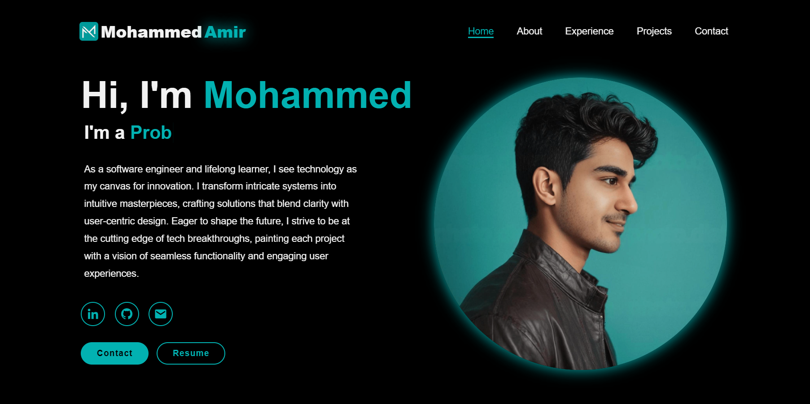

## Hi, My Name's Mohammed:
#### Hi, my name is Mohammed Amir. I'm a software engineer, full-stack developer, problem solver, and project management expert based in Toronto, Ontario, Canada. Have a look at my portfolio, the recent projects I've worked on, and feel free to get in touch.
&nbsp;

## The Portfolio:
#### The website can be found at: https://www.mohammedmamir.com The portfolio itself is loosely based off of Amelia Morgan's template along with my own personal spin of things I thought would be both fun, engaging, and challenging to add: https://www.youtube.com/watch?v=UqHILyzcULE&list=PL4FL-XepWXtsSXCijZOvvOI8DhB2951sC&index=1&ab_channel=HowtoWebDev

#### If you are to fork or copy the source code you MUST reference the original work both here and at the link above. Cheers!

## My Approach to Software:
#### As a software engineer and lifelong learner, I see technology as my canvas for innovation. I transform intricate systems into intuitive masterpieces, crafting solutions that blend clarity with user-centric design. Eager to  shape the future, I strive to be at the cutting edge of tech breakthroughs, painting each project with a vision of seamless functionality and engaging user experiences

## About Me:
#### I thrive on tackling intricate, real-world challenges and am dedicated to honing my skills in the dynamic field of software engineering. With a strong foundation in project management and a collaborative mindset, I excel in working seamlessly within team environments to deliver innovative and effective solutions. As a graduate from the University of Toronto with 2+ years in database management, automation, and programming, I have skills in artificial intelligence, software engineering, project management, and user experience design.
